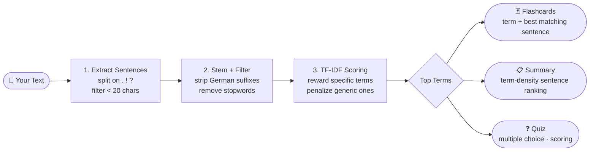

# StudyBot

**Turn any lecture text into flashcards, a summary, and a quiz — instantly, in your browser.**

StudyBot is a client-side React app built for students who need to convert raw study material into interactive learning content without copy-pasting into multiple tools. Paste your text, click Generate, and start learning in under 10 seconds.

> Software Engineering Project | Die Letzte Reihe

[](https://github.com/lejmi-amine/Die-Letzte-Reihe/actions/workflows/lint.yml)


---

## Who Is This For?

|                  |                                                                                                   |
| ---------------- | ------------------------------------------------------------------------------------------------- |
| **Role**         | Students and self-learners                                                                        |
| **Skill level**  | No technical background needed to use the app. Basic terminal knowledge required for local setup. |
| **Context**      | Exam preparation, lecture review, self-study sessions                                             |
| **Primary goal** | Quickly generate study material (flashcards, summary, quiz) from a block of text                  |

---

## Quick Start

Get StudyBot running locally in under 2 minutes.

**Prerequisites:**

- [Node.js](https://nodejs.org/) 18 or higher
- npm (included with Node.js)

```bash
# 1. Clone the repository
git clone https://github.com/lejmi-amine/Die-Letzte-Reihe.git
cd Die-Letzte-Reihe/StudyBot

# 2. Install dependencies
npm install

# 3. Start the dev server
npm run dev
```

Open your browser at **`http://localhost:3000`**.

**First successful outcome:** Paste any paragraph of text into the input field, click **Generate**, and you will see your first set of flashcards within seconds.

---

## Core Concept: Text → Key Terms → Study Material

StudyBot runs entirely in your browser — no external AI service, no API key, no data leaving your device. It uses a custom NLP pipeline:



**Mental model:** Think of it as a smart highlighter with linguistic awareness. It groups inflected German word forms together (e.g. *Lernende*, *Lernenden*, *Lernender* → same concept), then ranks terms by how specific they are to your text rather than how often they appear globally. The richer your input, the better the output — a dense lecture paragraph works much better than a bullet-point list.

---

## How To: Generate Your First Flashcard Set

1. Open the app at `http://localhost:3000`
2. Paste a paragraph of lecture text into the input field (minimum 30 characters)
3. Click the **Generate** button
4. Navigate to the **Karteikarten** tab
5. Click any card to flip it and reveal the answer
6. Use the **Shuffle** button to randomize card order
7. Use the card count selector (**6 / 9 / 12 / 15**) to adjust how many cards are shown
8. Press **→** / **←** arrow keys to navigate between cards without using the mouse

> **Tip:** For best results, use a continuous paragraph of at least 3–5 sentences. The more content words your text contains, the more accurate the generated cards will be.

---

## Example: Input → Output

**Input text:**

```
Photosynthese ist der Prozess, durch den Pflanzen Sonnenlicht in Energie umwandeln.
Chlorophyll ist das Pigment, das Licht absorbiert und die Reaktion ermöglicht.
Wasser und Kohlendioxid werden dabei in Glukose und Sauerstoff umgewandelt.
```

**Generated flashcard:**
| Front | Back |
|---|---|
| Was versteht man unter „Photosynthese"? | Photosynthese ist der Prozess, durch den Pflanzen Sonnenlicht in Energie umwandeln. |

**Generated summary excerpt:**

```
Überblick

Photosynthese ist der Prozess, durch den Pflanzen Sonnenlicht in Energie umwandeln.

Schlüsselbegriffe

Die wichtigsten Begriffe sind: Photosynthese, Chlorophyll, Kohlendioxid, Sonnenlicht, Sauerstoff.
```

**Generated quiz question:**

```
Welche Aussage über „Chlorophyll" ist korrekt?

  ○ Photosynthese ist ein unabhängiges Konzept ohne direkten Zusammenhang.
  ● Chlorophyll ist das Pigment, das Licht absorbiert und die Reaktion ermöglicht.
  ○ Es handelt sich um einen Aspekt von Kohlendioxid, nicht von Chlorophyll.
  ○ Chlorophyll bezieht sich ausschließlich auf Sauerstoff.
```

---

## Features

**Study tools:**

- Flashcards with flip animation and keyboard navigation
- Weighted card review — cards you rate poorly appear more often (Spaced Repetition Light)
- Shuffle and card count selector (6 / 9 / 12 / 15)
- Structured summary with key terms, overview, and conclusion sections
- Copy summary to clipboard
- Multiple-choice quiz with scoring

**Productivity:**

- Pomodoro timer in the header
- Learning history calendar (tracks daily study sessions)
- Drag & Drop file import (`.txt` files)

**UI:**

- Dark / Light mode toggle
- Responsive design — works on desktop and mobile

---

## Project Structure

```
StudyBot/
├── index.html                  # HTML entry point
├── package.json                # Dependencies and scripts
├── vite.config.js              # Vite configuration
├── src/
│   ├── main.jsx                # React entry point
│   ├── StudyBot.jsx            # Main component (UI and state)
│   └── studybot.logic.js       # Pure NLP logic (fully tested)
└── tests/
    └── studybot.logic.test.js  # 76 unit tests (Vitest)
```

The core NLP logic is fully separated from the UI in `studybot.logic.js`. This means it can be tested without a browser, DOM, or React.

---

## Running Tests

```bash
# Run all tests
npm test

# Run tests with coverage report
npm run test:coverage
```

**Current coverage** (`studybot.logic.js`):

| Statements | Branches | Functions | Lines |
| ---------- | -------- | --------- | ----- |
| 100%       | 92.59%   | 100%      | 100%  |

The HTML coverage report opens at `coverage/index.html` after running `npm run test:coverage`.

---

## Available Scripts

| Command                 | Description                                         |
| ----------------------- | --------------------------------------------------- |
| `npm run dev`           | Start development server at `http://localhost:3000` |
| `npm run build`         | Build for production                                |
| `npm run preview`       | Preview production build locally                    |
| `npm test`              | Run unit tests                                      |
| `npm run test:coverage` | Run tests and generate coverage report              |

---

## Tech Stack

| Layer        | Technology                                              |
| ------------ | ------------------------------------------------------- |
| UI framework | React 18 with Hooks                                     |
| Build tool   | Vite 6                                                  |
| Styling      | CSS-in-JS (inline styles with theme object)             |
| NLP / logic  | Custom TF-IDF + German stemmer + sentence scoring (`studybot.logic.js`) |
| Testing      | Vitest + @vitest/coverage-v8                            |
| CI           | GitHub Actions (Ruff linter + Vitest)                   |

---

## Maintainers

| Name                                          | Role                                                               |
| --------------------------------------------- | ------------------------------------------------------------------ |
| [Amine Lejmi](https://github.com/lejmi-amine) | Core logic, UI, CI/CD, testing                                     |
| David Liebermann                              | Features (Pomodoro, Lernhistorie, Karten-Bewertung), documentation |

---

## Further Resources

- [Docs/Architecture.md](../Docs/Architecture.md) — Component architecture and design patterns
- [Docs/TechStack.md](../Docs/TechStack.md) — Technology decisions and rationale
- [Docs/Unit-Tests.md](../Docs/Unit-Tests.md) — Testing strategy, mocking approach, and full test overview
- [Docs/user-stories.md](../Docs/user-stories.md) — User personas and product backlog
- [CONTRIBUTING.md](../CONTRIBUTING.md) — Setup guide, branch workflow, and commit conventions
- [retrospective.md](../retrospective.md) — Sprint retrospective with lessons learned
